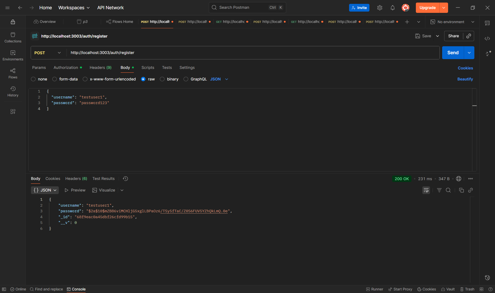
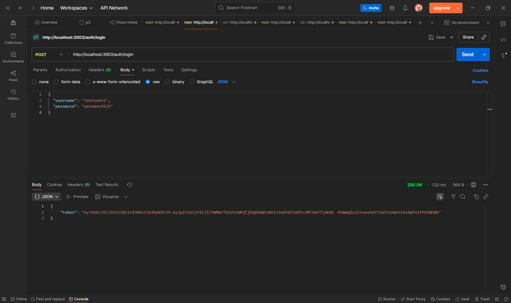
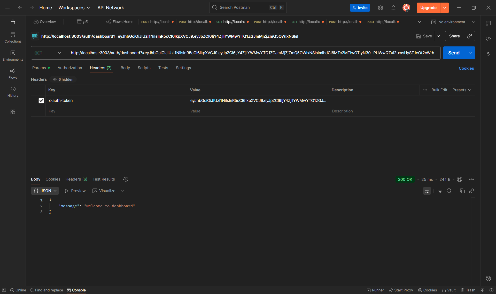
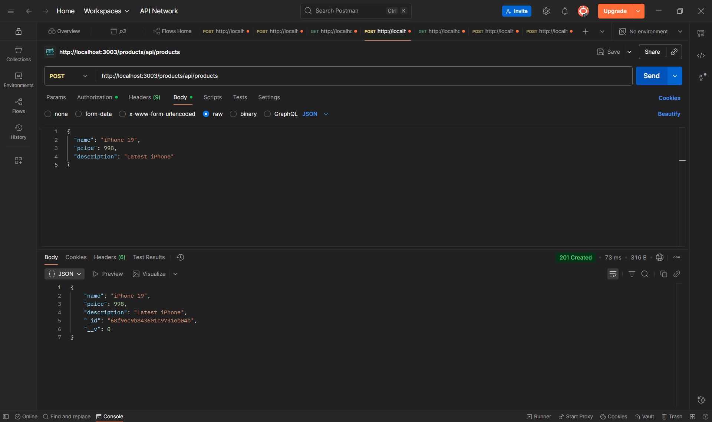
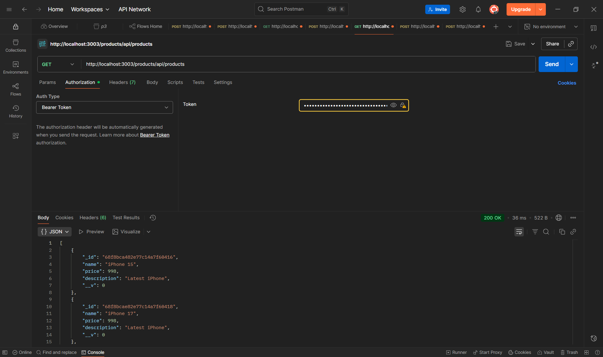
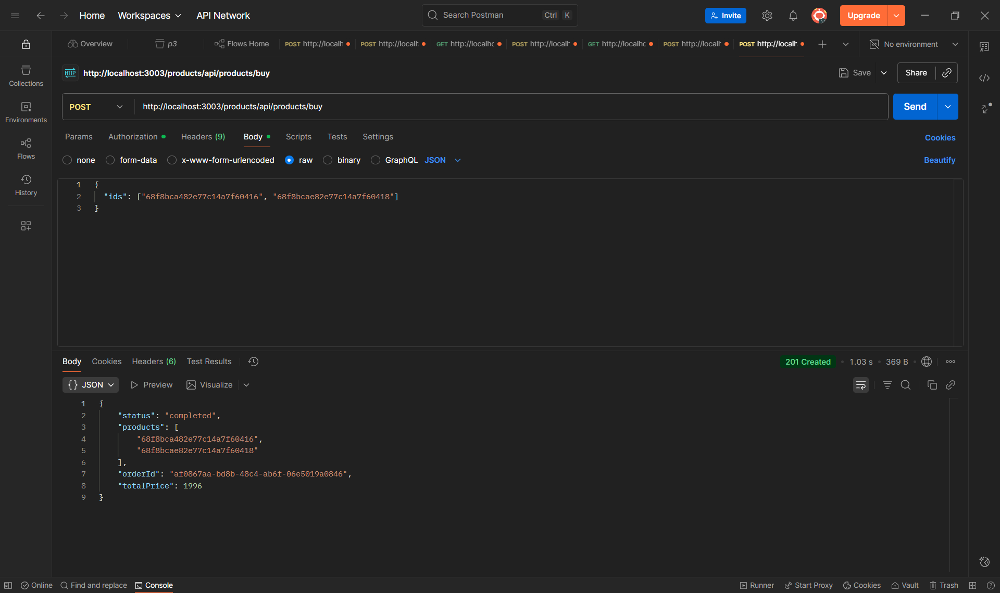

Bước 1: Đăng ký user
Request:

Method: POST

URL: http://localhost:3003/auth/register

Body (raw JSON):
{
  "username": "testuser1",
  "password": "password123"
}

ước 2: Đăng nhập để lấy token
Request:

Method: POST

URL: http://localhost:3003/auth/login

Body (raw JSON):
{
  "username": "testuser1",
  "password": "password123"
}

Lưu token này để dùng cho các request sau
Bước 3: Test dashboard (protected route)
Request:

Method: GET

URL: http://localhost:3003/auth/dashboard

Headers:

x-auth-token: [token từ bước 2]

Bước 4: Tạo product
Request:

Method: POST

URL: http://localhost:3003/products/api/products

Headers:

Authorization: Bearer [token từ bước 2]

Body (raw JSON):
{
  "name": "iPhone 19",
  "price": 999,
  "description": "Latest iPhone"
}

Bước 5: Lấy danh sách products
Request:

Method: GET

URL: http://localhost:3003/products/api/products
Headers:

Authorization: Bearer [token từ bước 2]

Bước 6: Mua hàng (tạo order)
Request:

Method: POST

URL: http://localhost:3003/products/api/products/buy

Headers:

Authorization: Bearer [token từ bước 2]

Body (raw JSON):
{
  "ids": ["product_id_1", "product_id_2"]
}
